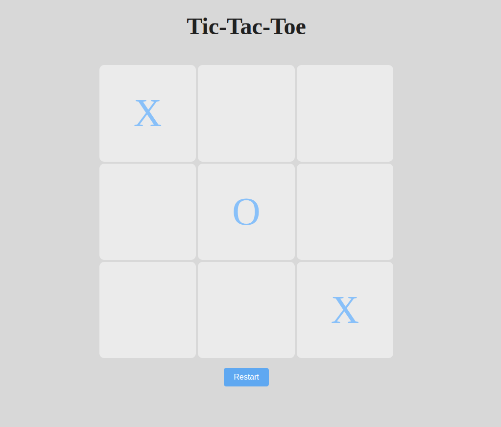

# 🕹️ Tic-Tac-Toe Game

A simple and fun implementation of the classic Tic-Tac-Toe game using HTML, CSS, and JavaScript. Play against a friend in your browser!

## 🎮 Live Demo

👉 [Play Now](https://thejas2246.github.io/Tic-Tac-Toe-js/)

## 📸 Screenshots

## 🚀 Features

- Two-player gameplay (Player X and Player O)
- Clear game win/draw detection
- Reset button to start a new game

## 🛠️ Tech Stack

- **Frontend:** HTML, CSS, JavaScript
- **Deployment:** GitHub Pages
